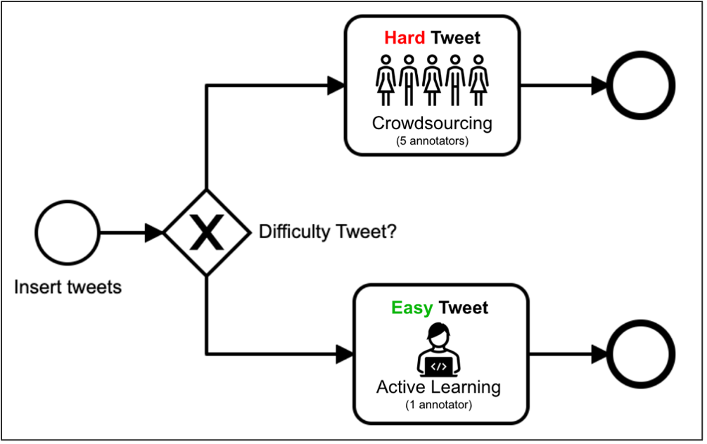

# Predicting Annotation Difficulty to Mitigate Annotator bias
This is the code repository for the master thesis Predicting Annotation Difficulty to Mitigate Annotator bias. 
The thesis investigates the demographic factors of annotator bias and presents a novel approach to mitigate this bias efficiently.

This thesis presents an annotation approach where tweets with unambigous sentiment is annotated using a single annotator setup and ambigous tweets are labeled using five annotators. To identify the two classes, a machine learning algorithm is used.

For the thesis the Dutch dataset was created by getting annotations for Dutch tweets from over 90 different annotators. The english dataset was collected from the internet.

## Data
Contains annotator data, tweets and pre-embedded tweets.

## Data Analysis
Data exploration and statistical analysis.

## ML Algorithms
Contains the Logistic Regression, XGBoost and Neural Network models. An evaluation of the models can be seen under Model Analysis.
